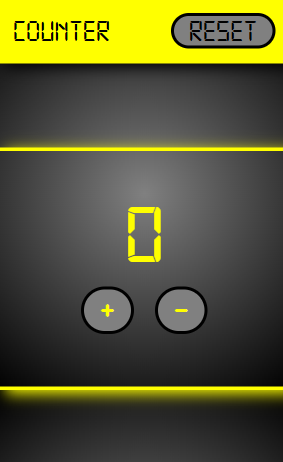

# Counter
> 

- [ai/size-limit](https://github.com/ai/size-limit#readme)
   

 In questo progetto ho realizzato una semplice applicazione counter.

## Come è stato realizzato:
- Ho usato Javascript,
 manipolando il DOM per creare ogni singolo elemento.

## Ora parliamo del suo funzionamento!!

 ## Condizione iniziale:
- Il counter parte da 0.
- I valori sono registrati in locale cosi da non perdere dati.

## Incremento:

- Se premi il bottone + o P incrementa il valore.
- Se tieni premuto, il valore aumenterà  automaticamente.
- Quando il valore incrementa il colore varia.

## Decremento:
- Se premi il bottone - o L decrementa il valore.
- Se tieni premuto, il valore decrementerà  automaticamente.
- Quando il valore decrementa il colore varia.

## Reset:
- Se premi il tasto Reset e azzera il valore.
- Per sicurezza ci sarà un alert di conferma.
- Il color rosso accompagnerà l`alert.